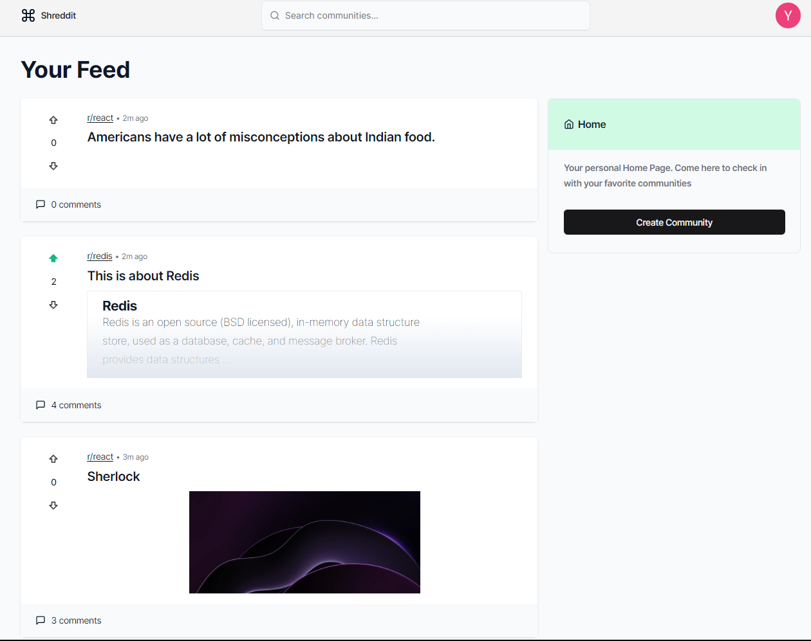
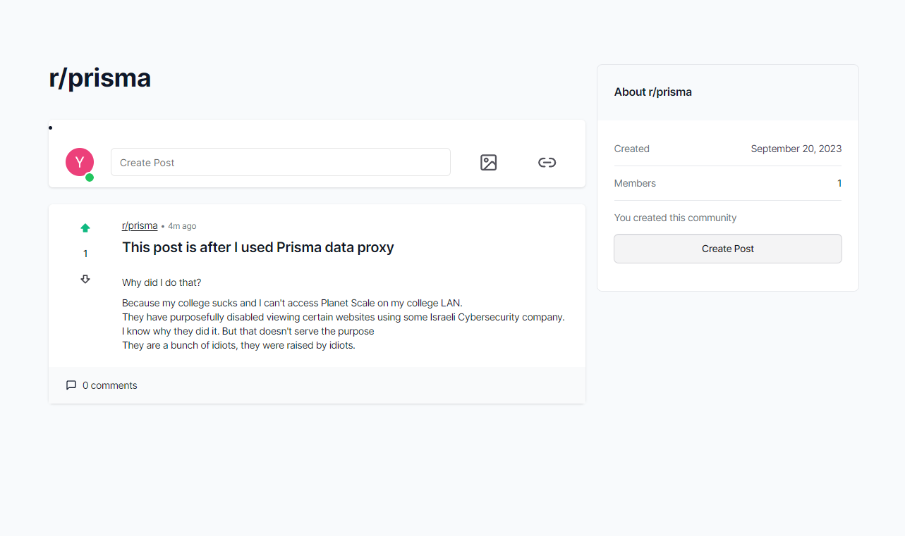
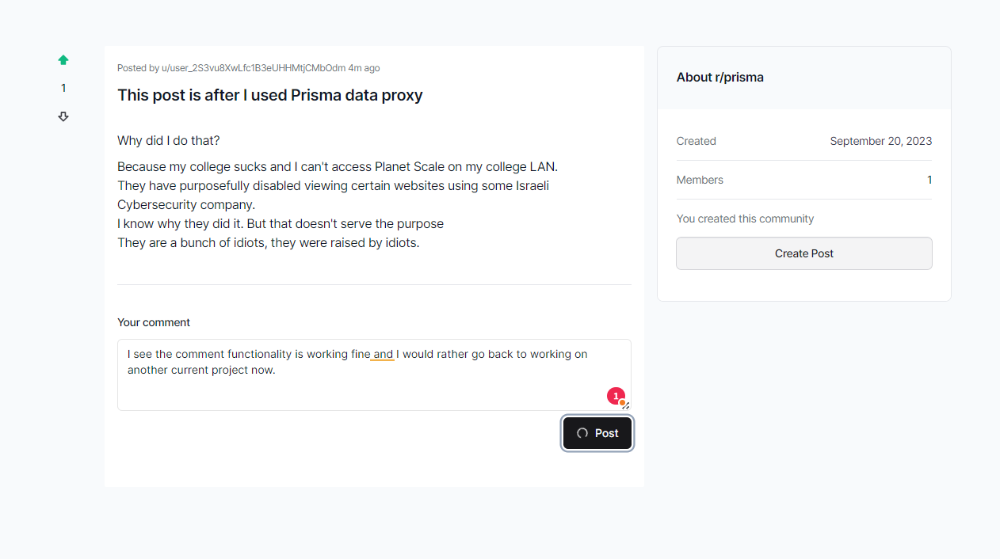
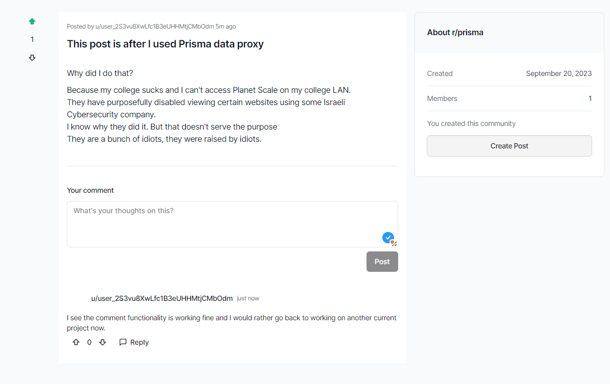
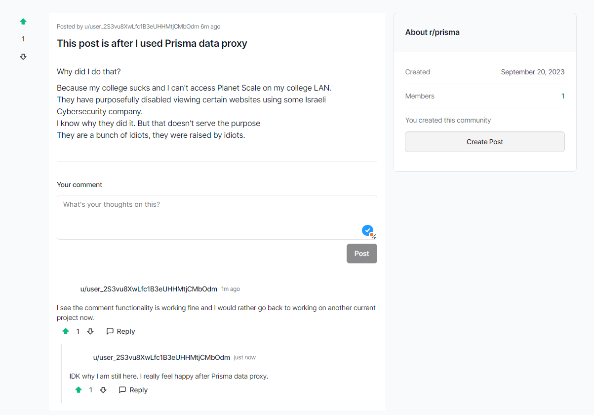

<h1 align="center">Shreddiit</h1>

> A Reddit like software for building a personalized community, and the primary motivation for me to build this app was to get it to use in front of my college mates but also to understand working in the new NextJS app router.

#### 📸 Screenshots

#### 🚀 Stack

- [NextJS](https://nextjs.org/)
- [TailwindCSS](https://tailwindcss.com/)
- [PlanetScale](https://planetscale.com/)
- [Vercel](https://vercel.com/)
- [Clerk](https://clerk.com)
- [Prisma](https://prisma.io)
